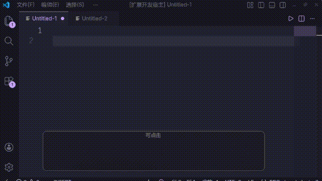

# bbcode-for-tsdm

VSCode扩展，支持TSDM风格的BBCode。

## 用法

自动识别`.bbcode`和`.bbcode.txt`后缀的文件，打开上述文件名后缀的文件即可。

或手动将文件识别的语言改为bbcode。

## 功能

* [x] 标签补全
* [x] html补全（已集成VSCode内置的html支持）
* [x] 标签属性补全
  * [x] `[size]`
  * [x] `[color]`，`[backcolor]`
  * [x] `[align]`
* [x] 重命名标签 `editor.action.rename`
* [x] 标签首尾跳转 `editor.action.revealDefinition`
* [x] 标签悬浮提示 `editor.action.showHover`
* [x] 语法检查（language-server）
  * [x] 未知的标签  [DiagErrUnknownTag](./docs/lsp/errors/DiagErrUnknownTag.md)
  * [x] 标签没有闭合 [DiagErrTagNotClosed](./docs/lsp/errors/DiagErrTagNotClosed.md)
  * [x] 标签没有开头 [DiagErrTagNotOpened](./docs/lsp/errors/DiagErrTagNotOpened.md)
  * [x] 无效的标签属性 [DiagErrInvalidAttributeValue](./docs/lsp/errors/DiagErrInvalidAttributeValue.md)
  * [x] 标签需要填写属性  [DiagErrAttributeRequired.](./docs/lsp/errors/DiagErrAttributeRequired.md)
  * [x] 标签不支持填写属性 [DiagErrAttributeNotAllowed](./docs/lsp/errors/DiagErrAttributeNotAllowed.md)
  * [x] 标签效果冲突 [DiagErrConflictStyle](./docs/lsp/errors/DiagErrConflictStyle.md)
  * [x] `[color]`和`[backcolor]`颜色无效 [DiagErrInvalidColor](./docs/lsp/errors/DiagErrInvalidColor.md)
  * [x] `[img]`图片大小无效 [DiagErrInvalidImageSize](./docs/lsp/errors/DiagErrInvalidImageSize.md)
  * [x] `[url]`缺少链接 [DiagErrUrlTargetRequired](./docs/lsp/errors/DiagErrUrlTargetRequired.md)
* [ ] 风格检查（linter）
  * [ ] 空标签
  * [ ] 块标签后没有换行

## 支持的标签

* 对齐`align`
* 背景颜色`backcolor`
* 粗体`bold`
* 代码块`codeBlock`
* 文字颜色`color`
* 水平分割线`hr`
* 字体大小`size`
* 免费区域`free`
* 隐藏区域`hide`
* 图片`img`
* 斜体`i`
* 列表`list`
* 列表元素`*`
* 引用`quote`
* 折叠区域`spoiler`
* 删除线`s`
* 上标`sup`
* 下标`sub`
* 表格`table`
* 表格行`tr`
* 表格单元格`td`
* 下划线`u`
* 链接`url`
* 提醒用户`@`

## 开发

### 安装依赖

`pnpm install`

### 调试

按F5或下方`Run Extension`开始调试

或`pnpm watch`

### 打包

`pnpm package:vsix`
